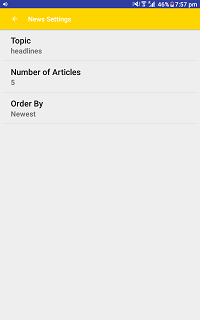
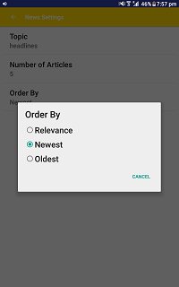
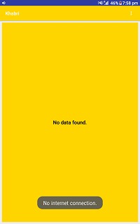

# Khabri - News Application
This application displays headlines using 'The Gurdian' api. The news headlines can be filtered and sorted. This project was a part of Udacity Google India Scholarship Android Basics Projects.

The objective of this project is to interact with an api as well as understand the use of Shared Preferences.

